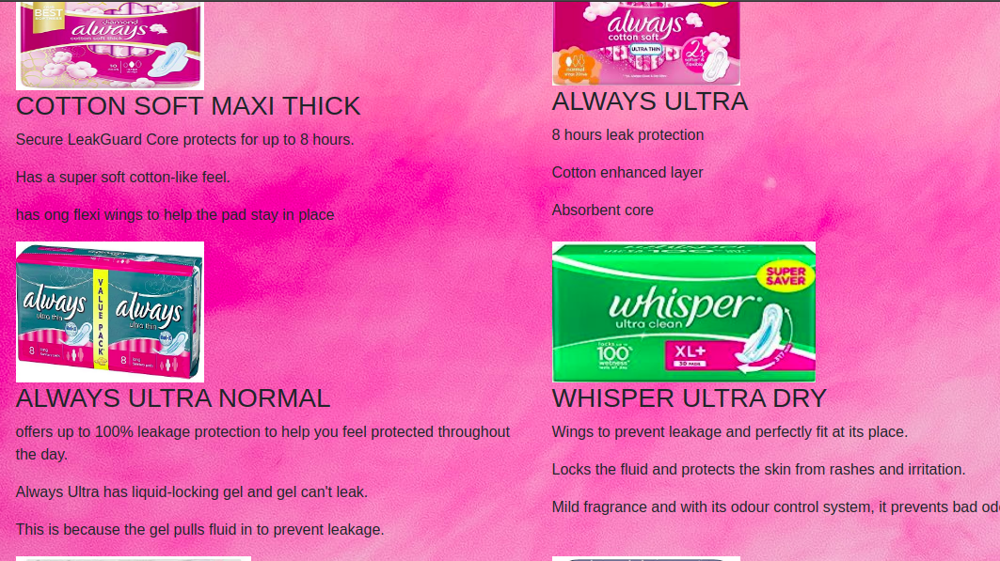

# Pinky App
 By Roselyne Akhonya, Justus Onyancha, Alice Mwihaki, Loice Muthoni.
## Description
This is an application specially designed for the feminine gender to help them acquire emergency sanitary towels at school or woekplace. 
## Visual representation
 

## BDD
The application allows the user to access a form on the products page and are able to key in their name and phone number. Using the checkboxes,
the user is able to check a variety of products they need. Once the user clicks on the submit button, it sends an alert message that the request has been received and they receive a notification message giving them details on where to pick the sanitary.
## Techologies used
This application was developed by incorporating the use of:
- HTML 
- CSS
- Bootstrap
- jQuery
## Contributions
- Go to github search Roseakhonya/Pizza-Express
- Clone repo
- Create your own branches
- Add and commit your changes
- Push it to the branch
- Submit a pull request
## Contacts and support
For more information feel free to reach out on pinkyapp@gmail.com or call us on 0724678026
## License
The MIT License (MIT)

Copyright (c) 2019 pinkieapp